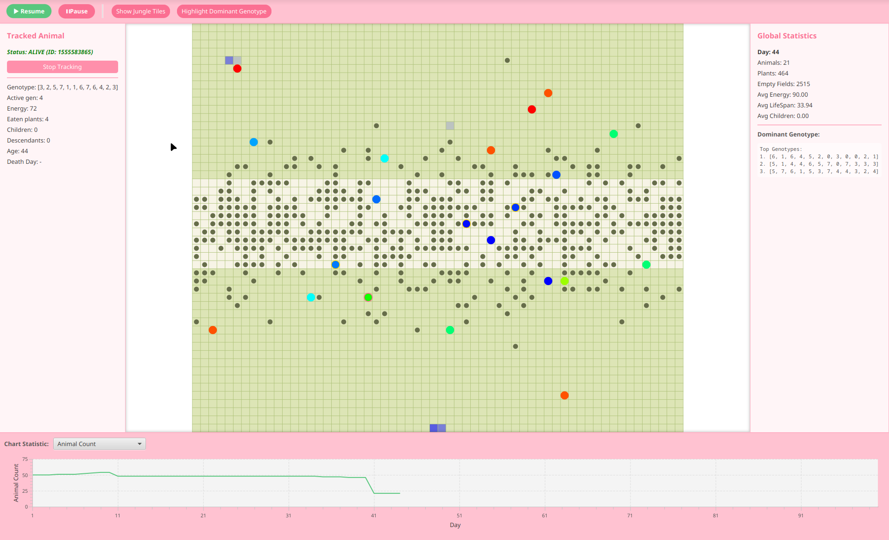

# 🌍 Darwin World Simulation 2025

[](https://openjdk.java.net/)
[](https://openjfx.io/)
[](https://gradle.org/)
[]()

An evolutionary biology simulation implementing **Variant F: Smells and Pheromones**. This project demonstrates advanced Object-Oriented Programming concepts, design patterns, and concurrent programming in Java with a fully-featured JavaFX GUI.

## 🎯 Overview



Darwin World Simulation is an educational project based on the [Obiektowe Lab Project](https://github.com/Soamid/obiektowe-lab/tree/master/proj) requirements. It simulates evolutionary processes where animals compete for resources, reproduce, and pass on their genetic traits to offspring.

### Variant F: Smells and Pheromones 🧪

Our implementation includes **Variant F**, which extends the base simulation with a chemical communication system:

- **Pheromone Trails**: Animals leave pheromones at reproduction sites
- **Chemical Navigation**: Animals can detect and follow pheromone trails within a configurable smell range
- **Emergent Behavior**: Creates clustering patterns and navigation strategies
- **Temporal Dynamics**: Pheromones decay over time, creating dynamic environment conditions

This variant adds realistic bio-inspired behavior where animals balance genetic instinct with environmental chemical cues.

---

## ✨ Features

### Core Simulation Features

- **Evolutionary Genetics**
  - Dynamic genotype system (12-128 genes with values 0-7)
  - Mutation system (0-100 mutations per offspring)
  - Inheritance from parents based on energy ratio
  - Genotype-driven movement and behavior

- **Animal Lifecycle**
  - Energy-based survival (eating, movement, reproduction)
  - Age tracking and lifespan statistics
  - Parent-child relationship tracking
  - Death from starvation or old age

- **World Mechanics**
  - Two map types: **EarthMap** (standard) and **FeromonMap** (pheromone-based)
  - Plant growth and consumption
  - 8-directional movement system
  - Boundary wrapping (East/West) and reflection (North/South)

- **Statistics & Visualization**
  - Real-time tracking of population, energy, lifespan
  - Most common genotype analysis
  - Line chart visualization with configurable metrics
  - CSV export for data analysis

### Variant F Specific Features

- **Pheromone System**
  - Pheromones created at reproduction sites
  - Manhattan distance-based smell detection
  - Configurable smell range (default: 3 tiles)
  - Configurable probability to follow pheromones (default: 60%)
  
- **Pheromone Decay**
  - Time-based decrease (configurable interval)
  - Automatic removal when value reaches zero
  - Visual intensity representation

- **Enhanced Movement**
  - Probabilistic choice between genetic movement and pheromone tracking
  - Animals move toward strongest detected pheromone
  - Unit-step movement in optimal direction

### Additional Extensions Implemented

1. **Advanced GUI Features**
   - Multi-window JavaFX application
   - Real-time simulation controls (play/pause/stop)
   - Interactive animal tracking (click to follow specific animals)
   - Configurable rendering options (grid, pheromones, preferred fields)

2. **Configuration System**
   - JSON-based configuration loading/saving
   - Visual configuration editor with validation
   - Pre-made scenarios (3 included)
   - 24+ configurable parameters

3. **Concurrency Support**
   - Multi-threaded simulation engine
   - Thread-safe collections for concurrent access
   - Multiple simultaneous simulations
   - Pause/resume/stop controls

4. **Comprehensive Testing**
   - JUnit 5 test suite
   - Unit tests for core components
   - Concurrent access testing
   - Genetic algorithm validation

---

## 📁 Project Structure

### Source Code Tree

```
src/
├── main/
│   ├── java/
│   │   └── agh/
│   │       └── ics/
│   │           └── oop/
│   │               ├── WorldGUI.java                    # Main entry point
│   │               ├── configuration/                   # Configuration management
│   │               │   ├── ConfigAnimal.java
│   │               │   ├── ConfigBuilder.java
│   │               │   ├── ConfigLoadFromJSON.java
│   │               │   └── ConfigMap.java
│   │               ├── exception/                       # 16 custom exceptions
│   │               │   ├── ConfigurationException.java
│   │               │   ├── IllegalAnimalCountException.java
│   │               │   ├── IllegalSmellRangeException.java
│   │               │   └── ... (13 more)
│   │               ├── model/                          # Core simulation model
│   │               │   ├── elements/                   # World entities
│   │               │   │   ├── Animal.java
│   │               │   │   ├── Feromon.java           # Pheromone implementation
│   │               │   │   ├── Genotype.java
│   │               │   │   ├── Plant.java
│   │               │   │   └── WorldElement.java
│   │               │   ├── map/                       # Map implementations
│   │               │   │   ├── EarthMap.java          # Standard map
│   │               │   │   ├── FeromonMap.java        # Pheromone map (Variant F)
│   │               │   │   ├── MapElementsManager.java
│   │               │   │   ├── MapType.java
│   │               │   │   └── WorldMap.java          # Map interface
│   │               │   ├── observators/               # Observer pattern
│   │               │   │   ├── MapChangeListener.java
│   │               │   │   └── StatsChangeListener.java
│   │               │   ├── stats/                     # Statistics tracking
│   │               │   │   ├── CSVSaver.java
│   │               │   │   ├── SimulationStatsTracker.java
│   │               │   │   └── StatsRecord.java
│   │               │   └── util/                      # Utility classes
│   │               │       ├── Boundary.java
│   │               │       ├── MapDirection.java
│   │               │       ├── MoveValidator.java
│   │               │       ├── NormalPositionGenerator.java
│   │               │       └── Vector2d.java
│   │               ├── simulation/                    # Simulation engine
│   │               │   ├── Simulation.java
│   │               │   └── SimulationEngine.java
│   │               └── simulationGUI/                 # JavaFX GUI
│   │                   ├── ChartManager.java
│   │                   ├── ConfigurationWindowPresenter.java
│   │                   ├── MapRenderer.java
│   │                   ├── RenderContext.java
│   │                   ├── SimulationApp.java
│   │                   ├── SimulationWindowPresenter.java
│   │                   ├── StartWindowPresenter.java
│   │                   └── StatsPresenter.java
│   └── resources/
│       ├── configurationWindow/
│       │   └── configuration-window.fxml
│       ├── simulationWindow/
│       │   └── simulation-window.fxml
│       └── startWindow/
│           ├── icon.png
│           └── start-window.fxml
├── premade_configurations/                            # Pre-made scenarios
│   ├── bigFeromoneMap.json                           # Large pheromone map
│   ├── mediumEarthMap.json                           # Medium standard map
│   └── smallFeromoneMap.json                         # Small pheromone map
└── test/
    └── java/
        └── agh/
            └── ics/
                └── oop/
                    └── model/
                        ├── elements/                  # Entity tests
                        │   ├── AnimalTest.java
                        │   └── GenotypeTest.java
                        ├── map/                       # Map tests
                        │   ├── EarthMapTest.java
                        │   ├── FeromonMapTest.java
                        │   └── MapElementsManagerTest.java
                        └── util/                      # Utility tests
                            ├── MapDirectionTest.java
                            └── Vector2dTest.java
```

**Statistics:**
- 51 Java source files
- 7 test classes
- 3 FXML layouts
- 3 pre-made configurations
- 16 custom exception types

---

## 🎨 Design Patterns Implemented

This project demonstrates professional software engineering through multiple design patterns:

### 1. **Observer Pattern** 👁️
- **Interfaces:** `MapChangeListener`, `StatsChangeListener`
- **Subjects:** `WorldMap`, `SimulationStatsTracker`
- **Observers:** GUI presenters, CSV export
- **Purpose:** Decouples simulation logic from UI updates; enables multiple observers

### 2. **Strategy Pattern** 🎯
- **Context:** `WorldMap` interface
- **Strategies:** `EarthMap` (standard behavior) and `FeromonMap` (pheromone-based)
- **Selection:** Runtime choice via `MapType` enum
- **Benefit:** Easily switch between different simulation behaviors

### 3. **Factory Pattern** 🏭
- **Location:** `Simulation` constructor
- **Purpose:** Creates appropriate map type based on configuration
```java
this.map = (configMap.mapType() == MapType.EARTH_MAP) 
    ? new EarthMap(configMap) 
    : new FeromonMap(configMap);
```

### 4. **Builder Pattern** 🔨
- **Class:** `ConfigBuilder`
- **Purpose:** Constructs complex configuration objects with validation
- **Features:** Fluent API, parameter validation, GUI integration

### 5. **Template Method Pattern** 📋
- **Base:** `EarthMap.handleReproductionAtPosition()`
- **Override:** `FeromonMap.handleReproductionAtPosition()`
- **Extension:** Adds pheromone creation to reproduction process

### 6. **MVC (Model-View-Controller)** 🏗️
- **Model:** `WorldMap`, `Animal`, `Plant`, `Genotype`
- **View:** FXML layouts, `MapRenderer`
- **Controller:** Presenter classes (`SimulationWindowPresenter`, etc.)
- **Benefit:** Clear separation of concerns

### 7. **Thread-Safe Collection Pattern** 🔒
- **Implementation:** `MapElementsManager`
- **Uses:** `ConcurrentHashMap`, `CopyOnWriteArrayList`
- **Purpose:** Safe concurrent access by multiple simulation threads

### 8. **Singleton-like Pattern** 🎲
- **Class:** `SimulationEngine` with `ForkJoinPool`
- **Purpose:** Centralized thread pool management

---

## 🛠️ Technologies

| Technology | Version | Purpose |
|------------|---------|---------|
| **Java** | 25 | Core programming language |
| **JavaFX** | 21 | GUI framework |
| **Gradle** | 9.1.0 | Build automation |
| **JUnit** | 5.10.0 | Unit testing framework |
| **Jackson** | 2.15.2 | JSON serialization/deserialization |

### Key Dependencies

```gradle
javafx.base, javafx.controls, javafx.fxml, javafx.graphics
com.fasterxml.jackson.core:jackson-databind:2.15.2
org.junit.jupiter:junit-jupiter:5.10.0
```

---

## 🚀 Getting Started

### Prerequisites

- **Java Development Kit (JDK) 25** or higher
- **Gradle** (wrapper included, so no installation needed)
- **Operating System:** Windows, macOS, or Linux

### Verify Java Installation

```bash
java -version
# Should output: java version "25" or higher
```

---

## 🏗️ How to Build and Run

### Option 1: Using Gradle Wrapper (Recommended)

#### On Unix/Linux/macOS:

```bash
# Navigate to project directory
cd project

# Build the project
./gradlew build

# Run the application
./gradlew run
```

#### On Windows:

```cmd
REM Navigate to project directory
cd project

REM Build the project
gradlew.bat build

REM Run the application
gradlew.bat run
```

### Option 2: Build and Run JAR

```bash
# Build JAR file
./gradlew jar

# Run the JAR
java -jar build/libs/project-1.0-SNAPSHOT.jar
```

### Option 3: Create Distribution

```bash
# Create distribution package
./gradlew installDist

# Run from distribution
./build/install/project/bin/project
```

### Available Gradle Tasks

```bash
./gradlew tasks

# Common tasks:
# - build: Compile and test the project
# - run: Run the application
# - test: Run unit tests
# - clean: Clean build artifacts
# - jar: Create JAR archive
```

---

## ⚙️ Configuration

### Using Pre-made Configurations

The project includes 3 pre-configured scenarios in `src/premade_configurations/`:

1. **bigFeromoneMap.json** - Large pheromone map (60×50, 50 animals)
2. **smallFeromoneMap.json** - Compact pheromone map for quick testing
3. **mediumEarthMap.json** - Standard map without pheromones

### Configuration Parameters

#### Animal Parameters
| Parameter | Description | Example |
|-----------|-------------|---------|
| `initialAnimalCount` | Starting number of animals | 50 |
| `initialEnergy` | Starting energy per animal | 80 |
| `maxEnergy` | Maximum energy capacity | 150 |
| `energyToReproduce` | Energy required for reproduction | 60 |
| `energyConsumedByMove` | Energy cost per movement | 2 |
| `energyGainedByEating` | Energy from eating a plant | 20 |
| `minMutations` | Minimum mutations per offspring | 0 |
| `maxMutations` | Maximum mutations per offspring | 2 |
| `genotypeLength` | Number of genes in genotype | 12 |

#### Map Parameters
| Parameter | Description | Example |
|-----------|-------------|---------|
| `width` | Map width in tiles | 60 |
| `height` | Map height in tiles | 50 |
| `startPlantNumber` | Initial plant count | 120 |
| `dailyPlantNumber` | Plants grown per day | 15 |
| `mapType` | Map type: `EARTH_MAP` or `FEROMON_MAP` | `FEROMON_MAP` |

#### Pheromone Parameters (Variant F only)
| Parameter | Description | Example |
|-----------|-------------|---------|
| `moveToFeromonProbability` | Probability to follow pheromones (0.0-1.0) | 0.6 |
| `daysToDecreaseFeromon` | Days between pheromone decay | 5 |
| `smellRange` | Detection range in Manhattan distance | 3 |

### Example Configuration

```json
{
  "initialAnimalCount": 50,
  "initialEnergy": 80,
  "maxEnergy": 150,
  "energyToReproduce": 60,
  "energyConsumedByMove": 2,
  "energyGainedByEating": 20,
  "minMutations": 0,
  "maxMutations": 2,
  "genotypeLength": 12,
  "width": 60,
  "height": 50,
  "startPlantNumber": 120,
  "dailyPlantNumber": 15,
  "mapType": "FEROMON_MAP",
  "moveToFeromonProbability": 0.6,
  "daysToDecreaseFeromon": 5,
  "smellRange": 3
}
```

### Creating Custom Configurations

1. Launch the application
2. Click "New Simulation"
3. Adjust parameters using the configuration window
4. Click "Start Simulation"
5. Optionally save configuration to JSON file

---

## Authors

- [Juliet2112](https://github.com/juliet2112)
- [Juliarzymowska](https://github.com/juliarzymowska)

---

## 📚 Credits

### Project Base
This project is based on the **Obiektowe Lab Project** from AGH University:
- Original repository: [Soamid/obiektowe-lab](https://github.com/Soamid/obiektowe-lab/tree/master/proj)

---

## 📄 License

This is an educational project developed for academic purposes.

---

**Enjoy exploring evolutionary dynamics with Darwin World Simulation! 🌍🧬**
